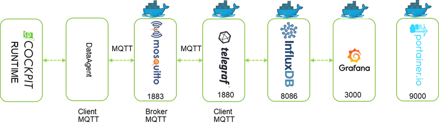

# mtig_edge


## Description
Ce dépôt contient tout le nécessaire pour installer l'ensemble de containers suivant l'architecture suivante : 
<div style="text-align: center">

</div>

Des variables sont postées en MQTT via la bibliothèque e!COCKPIT WagoAppCloud. Le broker MQTT (Mosquitto) est hébergé sur le contrôleur. \
L'applicatif Telegraf est abonné au topic MQTT sur ce broker, et poste les données dans une base InfluxDB dans un container dédié. \
Enfin les données sont affichées via l'outil de visualisation Grafana.  \
Le client MQTT est généralement un contrôleur WAGO.  \
L'outil de gestion de containers Portainer est également installé pour faciliter la maintenance des containers.

Le script bash permet d'automatiser le téléchargement des images Docker, fichiers de configuration et package nécessaires et leurs installations.

## Prérequis

Ce script fonctionne sur les plateformes suivantes : 
- Edge Computer (752-9400 & 752-9401)

Le Edge Computer doit disposer d'un accès à Internet (penser à renseigner DNS et Gateway).

http://[adresseIPduEdgeComputer]:9090/network

La date et heure du contrôleur doivent être mises à jour pour éviter des erreurs lors de l'échange TLS. 
Dans le WBM, mettre à jour l'heure dans http://[adresseIPduEdgeComputer]:9090/system

## Installation
Se connecter en SSH au contrôleur via PuTTy par exemple, en tant que super utilisateur (<em>root / wago</em> par défaut, penser à le modifier).

Exécuter la commande suivante qui permet le téléchargement de ce script, lui donne les droits d'exécution et l'exécute.

```
wget https://raw.githubusercontent.com/quenorha/mtig_edge/main/install_edge.sh -O $PWD/install_edge.sh && chmod +x install_edge.sh && ./install_edge.sh
```

## Configuration
 
###  1) Connexion au broker MQTT

Dans le cas où les données sont publiées en MQTT par un contrôleur WAGO, dans le WBM de ce dernier, au niveau de Configuration / Cloud Connectivity, configurer la connexion au broker comme suit :

	Service enabled : |X|
	Cloud Platform : MQTT AnyCloud
	Hostname : [Adresse IP du broker]
	Client ID  : NomduClientMQTT (ne peut être vide)
	Clean session : |X|
	TLS : | |
	Port : 1883
	CA file : /etc/ssl/certs/ca-certificates.crt (par défaut)
	User : 
	Password :
	Certification file : 
	Key file : 
	Use compression : | |
	Data protocol : Native MQTT
	Cache Mode : RAM (volatile)


### 2) Publication des données

Toujours dans le cas où les données sont publiées en MQTT par un contrôleur WAGO, télécharger et adapter le <a href="https://raw.githubusercontent.com/quenorha/mtig/main/WagoAppCloud_Influxdb_1.8.ecp">projet d'exemple e!COCKPIT</a>.

Le payload du message MQTT doit respecter le format InfluxDB line protocol :
	https://docs.influxdata.com/influxdb/v2.0/reference/syntax/line-protocol/
	
Dans cet exemple, le payload suivant est publié sur le topic wago/subtopic : 
 ```
processdata,source=Edge counter=12563signal=-58
 ```

### 3) Telegraf
Le fichier <b>/root/config/telegraf.conf</b> (dans le dossier /root/config) peut être adapté pour modifier le topic MQTT. 

Une fois la configuration modifiée, redémarrer le container Telegraf. 
 ```
 docker restart c_telegraf
 ```	 
Consulter les logs pour vérifier le bon fonctionnement (également possible depuis Portainer)
```
docker logs c_telegraf
```		 

### 4) Grafana

Se connecter à la page http://[adresseIPduContrôleur]:3000.  \
S'authentifier via admin / admin. \
Le mot de passe doit être modifié à la première connexion.  \
Aller dans <em>Configuration / Data sources</em> puis cliquer sur <em>Add data source</em>. \
Sélectionner InfluxDB. \
Au niveau de l'URL, renseigner http://c_influxdb:8086 \
Au niveau de <em>Database</em>, renseigner telegraf. Cette base est créée automatiquement par Telegraf. \
Cliquer sur <em>Save And Test</em>, <em>Data source is working</em> doit s'afficher en vert. 

## Evolution
Le MQTT doit être sécurisé en mettant en place les certificats TLS. 
